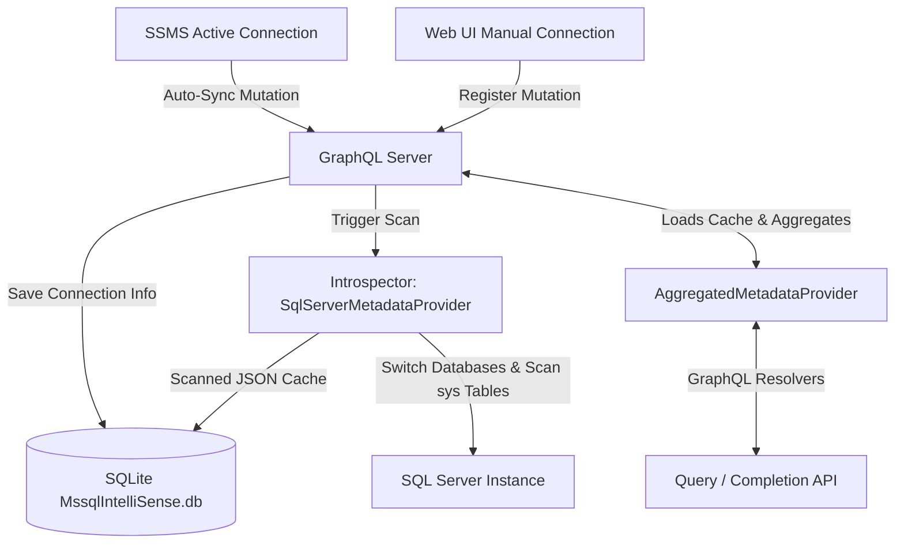

# Walkthrough: Multi-Connection Introspection & SQLite Cache Redesign

The GraphQL server database connection model has been redesigned to support multiple active SQL Server connections. SQLite (`MssqlIntelliSense.db`) now acts strictly as a persistent local store for the connection profiles and their scanned database schema caches (serialized as JSON).

## Redesigned Architecture

